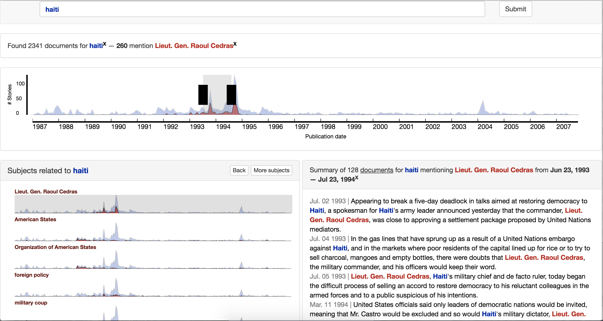

#### Rookie

Imagine you are a new reporter just assigned to a beat. Or a community activist interested in researching a certain political figure or government agency. News archives have lots of information that can help bring you up to speed. But reading the thousands (or millions) of news articles returned from a search enginge takes lots and lots of time. Rookie is designed to help. 

[Abe Handler](https://www.abehandler.com "Abe Handler") did most of the research and coding for Rookie. He got lots of conceptual help from [Steve Myers](https://twitter.com/myersnews "Steve Myers") and [Brendan O'Connor](http://brenocon.com "Brendan O'Connor").

This project began at [The Lens](http://www.thelensnola.org "The Lens") with [support](http://www.knightfoundation.org/grants/201550791/ "support") from the Knight foundation.

#### Code

You will need a copy of [Brendan O'Connor's wrapper for StanfordCore NLP](https://github.com/brendano/stanford_corenlp_pywrapper) to index Rookie documents.

`facets` the facet engine

`rookie_ui` React UI for rookie. use gulp b to push js to /webapp

`webapp` The Rookie webapp

#### Changes

- 8/3/16 Add in all sentences scrolling after user study. Change back to linear scaling. More event-y. See issue.
